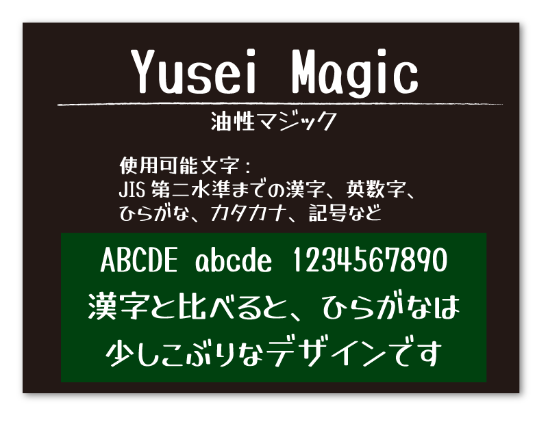
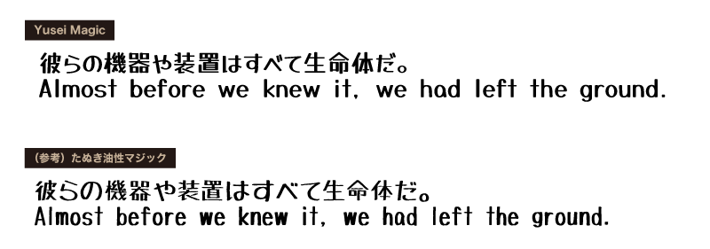

日本語の解説は後半に記載しています。/ Japanese descriptions are described in the [later part of this article](#はじめに).

---

## What is Yusei Magic?
Yusei Magic is a font based on handwritten letters written with permanent marker.
It has thick vertical strokes and thin horizontal strokes, so it is highly visible.
The design of the letters has both the strength of bold lines and the softness of spaciousness.
Highly recommended for handwriting on blackboards and pop art designs.
This font includes Google Latin Core, Hiragana, Katakana, JIS level 1, level 2 and IBM Extended Kanji (Han) glyphs.

## License
[SIL Open Font License Version 1.1][OFL]

## Usage Permission
- Please read [`OFL.txt`](OFL.txt) for more info.
- Enable others to use personal and non-commercial, and commercial projects.
- You can redistribute and modify this font.

## Link
Designer's website : https://tanukifont.com/

## Supported characters
- [Google Fonts Latin Core][GF]
- Hiragana
- Katakana
- Alphanumeric
- Kanji (JIS Level 1, Level 2, IBM Extended)
- Punctuation and symbols

Further information is available in [`documentation/YuseiMagic-Characters-List.pdf`](documentation/YuseiMagic-Characters-List.pdf)

------

## はじめに
こちらはSIL Open Font Licenseフォント「Yusei Magic」の開発プロジェクトです。  
フォント制作にあたり多大なるご支援を頂きました[Google Fonts](https://fonts.google.com/)に心より感謝いたします。  
プロジェクトのさらなる改善のため、皆様のご感想や改善案など頂けましたら幸いです。

## 「Yusei Magic」について
「Yusei Magic」は、2010年公開のフォント「たぬき油性マジック」をもとに新規に作成した、ペン字スタイルの手書き風日本語フォントです。極太な力強さとゆったりとした柔らかさの両方の特徴を併せ持ち、またペン先の形状を生かした太い縦画と細い横画で視認性・可読性を高めています。見出し・本文ともに使用可能なPOPフォントです。

## ライセンス
このフォントは、[SIL Open Font License Version 1.1][OFL]で公開しています。

## 収録グリフ
- [Google Latin Core][GF] （半角英数字、基本ラテン文字など216文字）
- ひらがな、カタカナ、全角英数、全角記号など
- 漢字（JIS第一水準、JIS第二水準、IBM拡張文字）

収録グリフの詳細は[`documentation/YuseiMagic-Characters-List.pdf`](documentation/YuseiMagic-Characters-List.pdf)でもご確認いただけます。

## SIL Open Font License (SILオープンフォントライセンス) Version 1.1 について
- 個人利用、商用利用に関わらず、使用用途を問わず無料で利用することができます。
- フォントファイルを内包したゲーム・アプリやPDF、Webフォントを作成する場合も、無償で利用することができます。
- このフォントを独自に調整したり改変して、派生フォントを作成することができます。ただし配布の際は下記の条件がございます。
    - SIL Open Font License Version 1.1 のライセンスで配布すること。（※すなわちフォントファイル単体での販売はできません）
- SILライセンスについての詳細は、[ライセンス原文日本語サイト][OFL]、またはリポジトリ内のOFL.txt（英語）をご確認ください。

## 作成者とご連絡先
デザイン : たぬきフォント　https://tanukifont.com/

お問い合わせがございましたら、たぬきフォントの[お問合せフォーム](https://tanukifont.com/contact-form/)、または作成者（たぬき侍）の[Twitter](https://twitter.com/tanukizamurai)までご連絡をお願いいたします。

[OFL]: https://ja.osdn.net/projects/opensource/wiki/SIL_Open_Font_License_1.1
[GF]:  https://github.com/googlefonts/gftools/blob/master/Lib/gftools/encodings/GF%20Glyph%20Sets/GF-latin-core_unique-glyphs.nam
